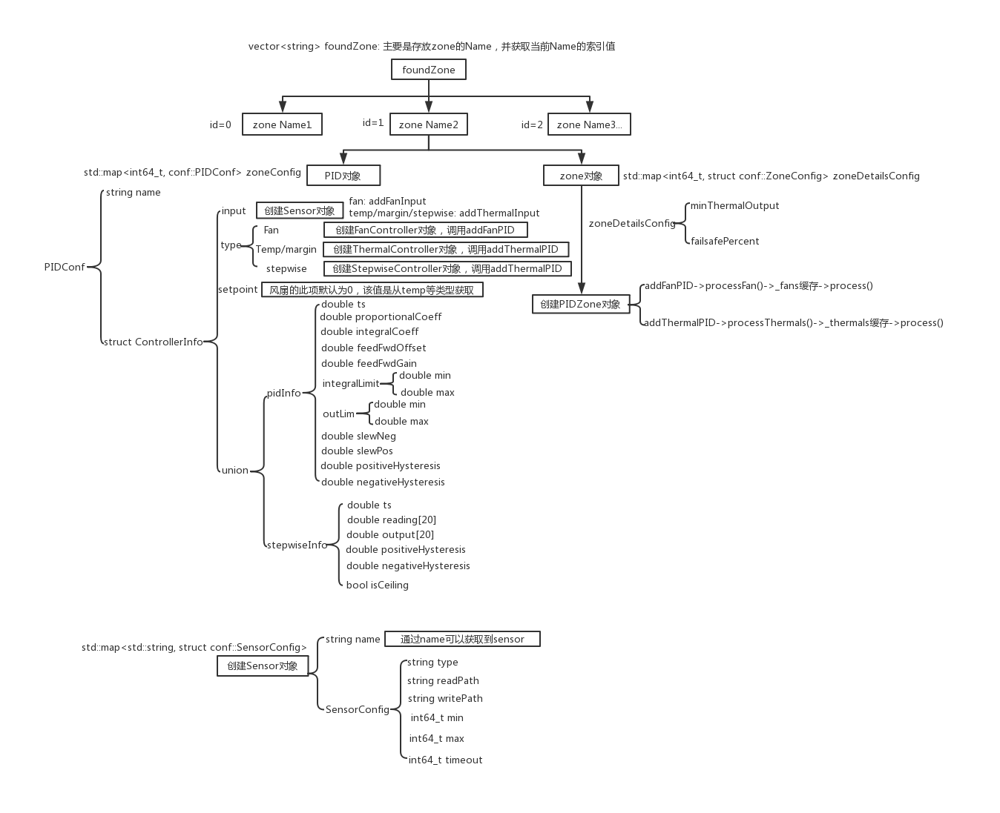

# Phosphor-pid-control概述

### 基本对象
1.Sensor  

    std::map<std::string, struct conf::SensorConfig>  

2.PID对象  

    std::map<int64_t, conf::PIDConf>  
    
3.Zone对象  

    std::map<int64_t, sturct conf::ZoneConfig>  
    
## 所有属性的获取方式
1.通过entity-manager和dbus-sensors模块中的实现，使用DBUS接口获取所有属性值并一次存入所有对象  
2.通过配置的json文件路径，解析json文件后，获取所有的属性值并一次存入所有对象  
## Phosphor-pid-control设计逻辑
1.phosphor-pid-control主要是有Sensor,Pid,Zone三个对象结构。  
2.每个Zone必须至少包含一个Pid和一个Sensor。  
3.每个Pid对象的input数组中接收的是传感器名称。  
4.每个Pid和Sensor都是通过Zone的Name属性关联。  
5.所有的Zone对象的Name属性需要单独存放在一个临时的vector缓冲区中并为每个Zone的名称生成一个唯一值index。

