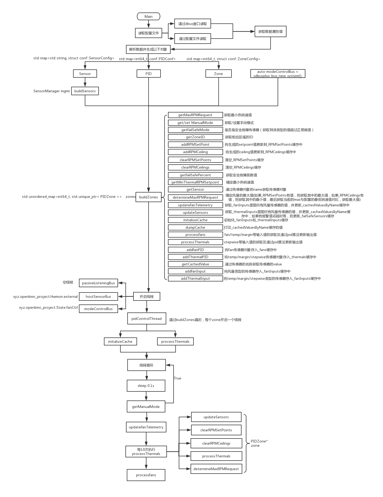

# Phosphor-pid-control概述

### 基本对象
1.Sensor  
    ```c++ 
    std::map<std::string, struct conf::SensorConfig>
    ```  
2.PID对象  
    ```c++ std::map<int64_t, conf::PIDConf>```  
3.Zone对象  
    ```c++ std::map<int64_t, sturct conf::ZoneConfig>```  
## 所有属性的获取方式
1.通过entity-manager和dbus-sensors模块中的实现，使用DBUS接口获取所有属性值并一次存入所有对象  
2.通过配置的json文件路径，解析json文件后，获取所有的属性值并一次存入所有对象  
## Phosphor-pid-control设计逻辑
1.phosphor-pid-control主要是有Sensor,Pid,Zone三个对象结构。  
2.每个Zone必须至少包含一个Pid和一个Sensor。  
3.每个Pid对象的input数组中接收的是传感器名称。  
4.每个Pid和Sensor都是通过Zone的Name属性关联。  
5.所有的Zone对象的Name属性需要单独存放在一个临时的vector缓冲区中并为每个Zone的名称生成一个唯一值index。

## Phosphor-pid-control执行流程
1.读取配置文件或者从DBUS接口获取数据并一次生成所有的对象(Sensor,PID,Zone)  
2.通过Sensor结构建立SensorManager  
3.通过SensorManager,PID,Zone建立Zone对象  
4.线程开启，监听xyz.openbmc_project.Hwmon.external，xyz.openbmc_project.State.FanCtrl等  
5.遍历Zones，为每个Zone开启一个线程  
6.缓冲区初始化  
7.线程循环，获取手动或自动模式，更新缓冲区中风扇传感器的值  
8.每10次执行热控制进程  
9.每次执行风扇传感器进程  

